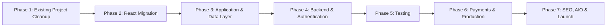

# APEX GYM — Modernization & Full-Stack Development Plan v2.0

## 1. Project Goal

Transform the existing **APEX GYM** website from a static HTML/CSS/JavaScript project into a modern, maintainable, tested, full-stack application.

The final system should support:

* Modern responsive frontend
* Product catalog
* Shopping cart
* Gym lesson/class booking
* Customer accounts
* Owner/Admin dashboard
* Secure authentication
* Real database
* Online payments
* Transactional emails
* Automated testing
* CI/CD deployment
* SEO and AIO optimization

The migration should happen incrementally so that the application remains functional after every major phase.

---

# 2. Target Architecture

## Frontend

**React + Vite**

Recommended technologies:

* React
* Vite
* JavaScript initially
* React Router
* CSS Modules or structured global CSS
* React Context or Zustand only if application state becomes complex

React + Vite is preferred over Next.js for this project because it provides the component architecture we need without adding unnecessary server-side framework complexity.

---

## Backend / Database

**Supabase**

Use Supabase for:

* PostgreSQL database
* Authentication
* User sessions
* Row-Level Security
* Storage if needed
* Backend/server functions where appropriate

---

## Payments

**Stripe**

Use:

* Stripe Checkout or Stripe Elements
* Stripe Webhooks
* Apple Pay / Google Pay where supported

Payment success must always be verified server-side.

---

## Email

Use either:

* Resend
* SendGrid

Emails may include:

* Order confirmation
* Booking confirmation
* Booking cancellation
* Admin alerts
* Calendar invitations

---

## Testing

### Unit / Component Testing

**Vitest**

### End-to-End Testing

**Playwright**

---

## Deployment

Recommended:

**Frontend**

* Vercel
* Netlify
* Cloudflare Pages

**Backend**

* Supabase

**CI/CD**

* GitHub Actions

---

# 3. Development Roadmap



---

# PHASE 1 — Existing Project Cleanup

## Goal

Prepare the current project for migration without spending significant time building architecture that will later be replaced by React.

---

## Step 1.1 — Normalize File Names

Rename files using standard kebab-case naming.

Examples:

```text
view my.html
→ my-bookings.html

view booking owner.html
→ admin-bookings.html

view orders owner.html
→ admin-orders.html

view performance owner.html
→ admin-analytics.html

view settings owner.html
→ admin-settings.html

book now.html
→ book.html

images/venmo pic
→ images/venmo.png
```

Update all affected:

* `<a href="">`
* `<script src="">`
* `<link href="">`
* Image paths
* Canonical URLs
* Sitemap references

---

## Step 1.2 — Organize Project Structure

Move the existing project toward a predictable structure.

Example:

```text
apex-gym/
│
├── public/
│   └── images/
│
├── legacy/
│   └── old-html-pages/
│
├── src/
│
├── README.md
└── package.json
```

Do not heavily refactor duplicated HTML components yet because React will replace them during Phase 2.

---

## Step 1.3 — Remove Obvious Technical Debt

Clean up:

* Dead JavaScript
* Duplicate CSS rules
* Unused images
* Duplicate event listeners
* Inline JavaScript where practical
* Broken links
* Console errors
* Invalid HTML
* Hardcoded absolute local file paths

---

## Step 1.4 — Preserve Existing Functionality

Before migration, verify that the existing flows still work:

* Navigation
* Products
* Cart
* Booking
* Login
* Owner dashboard
* Theme switching

At this stage, localStorage authentication may remain temporarily.

It must clearly be treated as **prototype authentication only**, not real application security.

---

# MILESTONE V1

At the end of Phase 1:

**The original site is cleaned, organized, and ready for migration.**

---

# PHASE 2 — React + Vite Migration

## Goal

Move the frontend into its final component-based architecture before adding substantial new functionality.

---

## Step 2.1 — Create React Application

Initialize:

```bash
npm create vite@latest
```

Select:

```text
React
JavaScript
```

Install dependencies:

```bash
npm install
npm install react-router-dom
```

Potential later dependencies:

```bash
npm install zustand
```

Do not introduce Zustand unless state complexity actually requires it.

---

## Step 2.2 — Establish Project Structure

Recommended structure:

```text
src/
│
├── components/
│   ├── Header.jsx
│   ├── Footer.jsx
│   ├── ProductCard.jsx
│   ├── Toast.jsx
│   └── LoadingSpinner.jsx
│
├── pages/
│   ├── Home.jsx
│   ├── Shop.jsx
│   ├── ProductDetails.jsx
│   ├── Cart.jsx
│   ├── Checkout.jsx
│   ├── Lessons.jsx
│   ├── BookLesson.jsx
│   ├── Login.jsx
│   ├── Register.jsx
│   └── Account.jsx
│
├── admin/
│   ├── AdminDashboard.jsx
│   ├── AdminOrders.jsx
│   ├── AdminBookings.jsx
│   ├── AdminProducts.jsx
│   └── AdminAnalytics.jsx
│
├── data/
│
├── hooks/
│
├── services/
│
├── utils/
│
├── styles/
│
├── App.jsx
└── main.jsx
```

---

## Step 2.3 — Convert Shared UI Into Components

Create reusable components.

Examples:

```text
<Header />
<Footer />
<ProductCard />
<CartItem />
<BookingCard />
<Toast />
<Modal />
<Button />
```

Remove duplicated navigation, footer, theme logic, and repeated layouts from the old HTML files.

---

## Step 2.4 — React Router

Create routes such as:

```text
/
/shop
/shop/:productId
/cart
/checkout

/lessons
/book/:classId

/login
/register
/account

/admin
/admin/products
/admin/orders
/admin/bookings
/admin/analytics
```

---

## Step 2.5 — Design System

Create reusable design tokens.

Example:

```css
:root {
    --color-primary: ...;
    --color-secondary: ...;
    --color-background: ...;
    --color-text: ...;

    --radius-small: ...;
    --radius-medium: ...;
    --radius-large: ...;

    --shadow-card: ...;

    --spacing-small: ...;
    --spacing-medium: ...;
    --spacing-large: ...;
}
```

Standardize:

* Typography
* Buttons
* Inputs
* Cards
* Navigation
* Modals
* Forms
* Spacing
* Shadows
* Animation

---

## Step 2.6 — Accessibility

Target WCAG 2.1 AA where practical.

Include:

* Keyboard navigation
* Visible focus states
* Proper labels
* Semantic HTML
* `aria-expanded`
* `aria-label`
* Accessible modals
* Color contrast
* Alt text

---

# MILESTONE V2

At this stage the project becomes a:

## Professional React Frontend

It should have:

* Responsive UI
* React routing
* Reusable components
* Product pages
* Cart UI
* Lesson pages
* Booking UI
* Owner/Admin interface

The data may still be local/mock data.

---

# PHASE 3 — Application & Data Layer

## Goal

Separate application logic from UI before connecting a database.

---

## Step 3.1 — Centralized Product Model

Create:

```text
src/data/products.js
```

Example:

```javascript
{
    id: "gym-mat-pro-01",
    name: "Apex Pro Folding Gymnastics Mat",
    category: "equipment",
    price: 149.99,
    rating: 4.9,
    reviewCount: 38,
    badge: "Best Seller",
    stock: 12,

    images: [
        "/images/products/mat-1.webp",
        "/images/products/mat-2.webp"
    ],

    specs: {
        thickness: "2 inches",
        material: "High-density EPE foam",
        dimensions: "4ft x 8ft"
    },

    description:
        "Competition-grade tumbling mat designed for safety, durability, and shock absorption."
}
```

---

## Step 3.2 — Dynamic Product Pages

Use:

```text
/shop/:productId
```

Include:

* Image gallery
* Product description
* Specifications
* Price
* Stock status
* Quantity selector
* Size/color variants
* Add to cart
* Related products
* Reviews UI

---

## Step 3.3 — Cart Architecture

Cart state should contain only references such as:

```javascript
{
    productId,
    variantId,
    quantity
}
```

Do not copy the entire product object into the cart.

Create operations for:

```text
addItem()
removeItem()
updateQuantity()
clearCart()
calculateSubtotal()
calculateDiscount()
calculateTax()
calculateShipping()
calculateTotal()
```

---

## Step 3.4 — Checkout Validation

Add:

* Empty cart protection
* Email validation
* Phone formatting
* Postal code validation
* Shipping validation
* Promo code validation
* Quantity validation
* Inventory validation

Show field-level errors.

---

## Step 3.5 — Booking Model

Create standardized booking objects.

Example:

```javascript
{
    id: "APX-2026-8492",
    classId: "private-gymnastics-01",
    coachId: "coach-01",
    customerId: "user-01",
    date: "2026-09-15",
    time: "16:00",
    status: "confirmed"
}
```

---

## Step 3.6 — Booking Conflict Logic

Prevent:

* Two customers booking the same private session
* Booking unavailable instructors
* Booking outside allowed hours
* Booking past dates

---

## Step 3.7 — Confirmation IDs

Generate booking references similar to:

```text
APX-2026-8492
```

Eventually these should be generated by the backend/database rather than trusted solely from the browser.

---

# PHASE 4 — Supabase Backend & Authentication

## Goal

Replace demo/localStorage data with persistent server-side data.

---

## Step 4.1 — Supabase Project

Create Supabase project and configure environment variables.

Example:

```text
VITE_SUPABASE_URL
VITE_SUPABASE_ANON_KEY
```

Never commit secret server keys to GitHub.

---

## Step 4.2 — Database Schema

Create tables:

```text
profiles
products
product_variants
classes
coaches
coaching_sessions
bookings
orders
order_items
promo_codes
reviews
```

---

## Step 4.3 — Profiles

Example:

```text
profiles

id
email
first_name
last_name
phone
role
created_at
updated_at
```

Role:

```text
customer
owner
```

Potential future roles:

```text
trainer
manager
```

---

## Step 4.4 — Authentication

Implement:

* Register
* Login
* Logout
* Forgot password
* Reset password
* Session persistence
* Protected routes

Replace the existing localStorage username/password implementation completely.

---

## Step 4.5 — Row-Level Security

Create Supabase RLS policies.

### Customers

Customers may:

* Read their own profile
* Update their own profile
* Read their own orders
* Read their own bookings
* Cancel eligible bookings

Customers must not access other customers' records.

### Owners

Owners may:

* Manage products
* View orders
* Update orders
* Manage bookings
* Manage classes
* View analytics
* Manage inventory

---

## Step 4.6 — Replace Mock Data

Gradually change:

```text
React → products.js
```

into:

```text
React
 ↓
Service Layer
 ↓
Supabase
 ↓
PostgreSQL
```

Example services:

```text
productService.js
bookingService.js
authService.js
orderService.js
```

UI components should not directly contain large amounts of database logic.

---

# MILESTONE V3

The application is now a:

## Real Full-Stack Application

Including:

* Real accounts
* Database
* Secure sessions
* Customer records
* Orders
* Bookings
* Products
* Admin authorization

---

# PHASE 5 — Automated Testing

## Goal

Protect critical business functionality against regressions.

---

## Step 5.1 — Vitest

Install:

```bash
npm install -D vitest
```

Test pure application logic.

Examples:

### Cart

```text
Add product
Remove product
Increase quantity
Decrease quantity
Clear cart
```

### Pricing

```text
Subtotal
Tax
Shipping
Coupon
Total
```

### Booking

```text
Available slots
Unavailable slots
Double bookings
Date validation
```

### Validation

```text
Email
Phone
Postal code
Promo code
```

---

## Step 5.2 — Playwright

Install Playwright and create E2E tests.

---

### Shopping Journey

```text
Home
→ Shop
→ Filter
→ Product
→ Add to Cart
→ Cart
→ Promo
→ Checkout
```

---

### Booking Journey

```text
Home
→ Lessons
→ Select Class
→ Select Coach
→ Select Date
→ Select Time
→ Submit Booking
→ Confirmation
```

---

### Authentication Journey

```text
Register
→ Login
→ Account
→ Logout
```

---

### Admin Authorization

Test:

```text
Customer attempts /admin
→ Access denied
```

and:

```text
Owner logs in
→ Admin dashboard accessible
```

---

### Responsive Testing

Validate important pages at:

* Desktop
* Tablet
* Mobile

Test mobile navigation and theme switching.

---

## Step 5.3 — CI Testing

Create GitHub Actions workflow.

Example pipeline:

```text
Push / Pull Request
       ↓
npm install
       ↓
Lint
       ↓
Vitest
       ↓
Build
       ↓
Playwright
       ↓
Deploy
```

---

# PHASE 6 — Payments & Commerce

## Goal

Turn the application into a functioning commerce platform.

---

## Step 6.1 — Stripe

Recommended first implementation:

**Stripe Checkout**

Later migrate to Stripe Elements only if greater checkout customization is required.

---

## Step 6.2 — Secure Payment Flow

Flow:

```text
Customer Checkout
       ↓
Create Stripe Checkout Session
       ↓
Stripe Hosted Checkout
       ↓
Payment
       ↓
Stripe Webhook
       ↓
Verify Payment
       ↓
Create / Update Order
       ↓
Send Confirmation
```

Never trust a browser redirect alone as proof that payment succeeded.

---

## Step 6.3 — Order System

Orders should include:

```text
order_number
customer_id
stripe_session_id
payment_status
order_status
subtotal
tax
shipping
discount
total
created_at
```

---

## Step 6.4 — Inventory

When payment succeeds:

```text
Verify stock
→ Record order
→ Reduce inventory
→ Confirm purchase
```

Avoid allowing inventory to become negative.

---

# PHASE 7 — Transactional Email

## Step 7.1 — Order Confirmation

Send:

* Order number
* Products
* Quantity
* Price
* Tax
* Total
* Shipping address

---

## Step 7.2 — Booking Confirmation

Send:

* Booking reference
* Class
* Coach
* Date
* Time
* Location
* Cancellation instructions

---

## Step 7.3 — Calendar Invitation

Generate an `.ics` event so customers can add lessons to:

* Google Calendar
* Apple Calendar
* Outlook

---

## Step 7.4 — Admin Notifications

Examples:

```text
New booking
New paid order
Low inventory
Cancelled booking
Payment failure
```

---

# PHASE 8 — Admin Dashboard

## Goal

Allow the owner to manage the application without changing code.

---

## Dashboard

Show:

```text
Today's Revenue
Monthly Revenue
Open Orders
Upcoming Lessons
Total Customers
Low Stock Items
Recent Bookings
```

---

## Products

Owner can:

```text
Add
Edit
Archive
Update price
Update inventory
Upload images
```

---

## Orders

Owner can:

```text
View
Search
Filter
Update status
Refund where supported
```

---

## Bookings

Owner can:

```text
View calendar
Search bookings
Cancel booking
Reschedule
Change trainer
Manage availability
```

---

# PHASE 9 — UI Polish

Add micro-interactions only after core functionality is stable.

Examples:

* Product card hover
* Cart drawer animation
* Skeleton loaders
* Toast notifications
* Button loading states
* Form success animations
* Sticky navigation
* Mobile drawer
* Smooth transitions

Avoid allowing animation work to delay functional development.

---

# PHASE 10 — SEO & AIO

## Traditional SEO

Add:

* Unique page titles
* Meta descriptions
* Canonical URLs
* Sitemap
* robots.txt
* OpenGraph
* Optimized images
* Semantic headings
* Internal linking

---

## Structured Data

Use applicable Schema.org types.

Potential types:

```text
GymOrSportsClub
SportsActivityLocation
Product
Offer
AggregateRating
Course
EducationEvent
FAQPage
BreadcrumbList
Organization
```

Only include structured data for information actually visible and supported by the page.

---

## AI Optimization / AIO

Make important business information easy for search and AI systems to understand.

Clearly expose:

* Business name
* Services
* Location
* Coaching offerings
* Product categories
* Prices where appropriate
* FAQs
* Contact information
* Instructor credentials where applicable

---

# PHASE 11 — Performance & Security

## Performance

Optimize:

* Images
* Lazy loading
* Bundle size
* API requests
* React rendering
* Database queries

Run Lighthouse tests.

Targets should be treated as goals rather than artificial score chasing.

---

## Security

Review:

* Supabase RLS
* Admin permissions
* Environment variables
* Stripe webhooks
* Input validation
* Rate limiting where needed
* XSS exposure
* Authentication flows
* Database policies

Never rely on frontend route hiding as security.

---

# PHASE 12 — Production Deployment

## Production Stack

Recommended:

```text
React + Vite
      ↓
Vercel / Netlify / Cloudflare

Supabase
      ↓
PostgreSQL + Auth

Stripe
      ↓
Payments

Resend
      ↓
Transactional Email
```

---

## GitHub Actions

Production flow:

```text
Developer Push
      ↓
GitHub
      ↓
Lint
      ↓
Vitest
      ↓
Build
      ↓
Playwright
      ↓
Deploy
```

---

# 4. Final Milestones

## V1 — Clean Existing Site

Deliverables:

* Clean filenames
* Organized project
* Broken links fixed
* Dead code removed
* Existing functionality preserved

---

## V2 — Professional React Frontend

Deliverables:

* React + Vite
* React Router
* Reusable components
* Responsive design
* Dynamic products
* Cart
* Booking interface
* Admin UI

---

## V3 — Full-Stack Application

Deliverables:

* Supabase
* PostgreSQL
* Authentication
* Role-based authorization
* Real products
* Orders
* Bookings
* Customer accounts

---

## V4 — Production Commerce Platform

Deliverables:

* Stripe
* Transactional emails
* Inventory
* Automated tests
* GitHub Actions
* SEO
* AIO
* Production deployment

---

# 5. Development Rules

The coding agent should follow these rules during implementation.

### Rule 1 — One Phase at a Time

Do not attempt the entire migration in one large change.

Complete and verify each phase before moving forward.

---

### Rule 2 — Preserve Working Features

Before replacing existing functionality, determine what the current version does and preserve valid behavior unless the roadmap explicitly changes it.

---

### Rule 3 — No Premature Backend Complexity

Do not introduce Supabase, Stripe, or email services during the initial React migration.

First build a stable frontend architecture.

---

### Rule 4 — No Premature State Library

Use React state and Context first.

Add Zustand only if application-wide state becomes difficult to manage cleanly.

---

### Rule 5 — Components Should Stay Focused

Avoid giant React files.

Separate:

```text
UI
Business logic
API/database logic
Utilities
State
```

---

### Rule 6 — Database Logic Belongs in Services

Prefer:

```javascript
productService.getProducts()
```

rather than scattering Supabase calls throughout React components.

---

### Rule 7 — Security Must Be Server-Enforced

Never treat:

```text
Hidden menu items
React route guards
localStorage values
Frontend role checks
```

as real authorization.

Supabase RLS/backend rules must enforce permissions.

---

### Rule 8 — Payments Must Be Server Verified

Never mark an order paid because the browser reached:

```text
/success
```

Stripe webhook verification determines payment status.

---

### Rule 9 — Test Business-Critical Logic

Prioritize tests for:

```text
Authentication
Authorization
Checkout
Pricing
Cart
Payments
Booking availability
Orders
```

Do not create meaningless tests purely to increase coverage percentages.

---

### Rule 10 — Keep Every Milestone Deployable

At the end of each major milestone:

```bash
npm run build
```

must succeed.

Existing tests must pass.

There should be no major console errors.

The application should remain demonstrable.

---

# Recommended Starting Point

Begin with:

## Phase 1 — Repository Cleanup

Complete:

1. Rename files containing spaces.
2. Update all references and links.
3. Organize assets and legacy files.
4. Remove unused/duplicate code.
5. Confirm every existing page still works.

Then immediately begin:

## Phase 2 — React + Vite Migration

Do **not** spend significant time building reusable vanilla JavaScript components that will later be discarded during the React migration.

The target architecture from that point forward should be:

```text
React + Vite
     ↓
Service Layer
     ↓
Supabase
     ↓
PostgreSQL
```

with:

```text
Vitest + Playwright
Stripe
Resend
GitHub Actions
```

added progressively as the project moves from frontend prototype → full-stack application → production platform.

